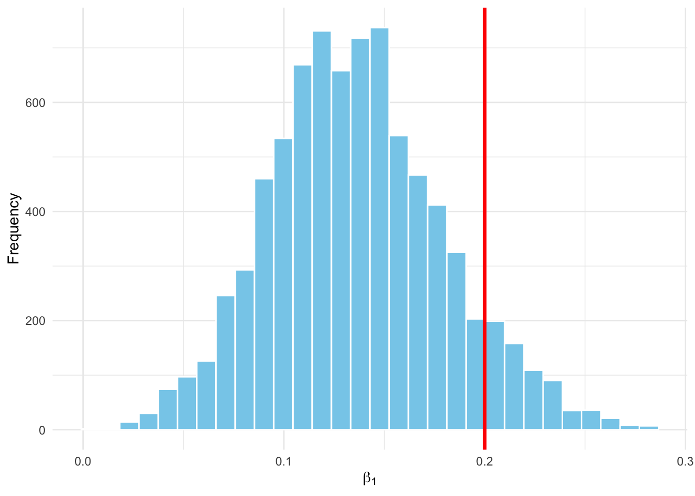

# Generalized linear models, and generalized linear mixed models {#glms}

## Introduction 

This chapter presents the application of Bayesian statistics to extensions of the linear model seen in the previous chapter: generalized linear models (GLMs) and generalized linear mixed models (GLMMs). We will start with a GLM that will allow us to revisit our running example on coypu (ragondin) survival and binary data. We will then use a GLMM to analyze count data. We will then use a GLMM to analyze count data. We will use `NIMBLE` and `brms` and compare with the frequentist approach.

## Generalized linear models (GLMs)

In Chapter \@ref(lms), we introduced linear regression \(y_i \sim N(\mu_i,\sigma^2)\) with \(\mu_i = \beta_0 + \beta_1 x_i\), where we model the mean \(\mu\) of the response variable \(y\) as a function of an explanatory variable \(x\). This so-called linear model is well suited to a continuous response variable. But what happens when the response variable is discrete? Let us go back to our coypu example in which we study the number of animals that survive. If we apply linear regression to these data, we will obtain a decimal number of coypu, which is a bit annoying for a count that is, by definition, discrete. Moreover, if we introduce an explanatory variable \(x_i\) such as body mass to explain variation in the number of coypu that survive, we may end up with a negative survival probability, or one greater than one. Why? Because nothing forces the linear model to consider only values that are positive and less than one.

We saw the solution in Chapter \@ref(principles). We set \(z_i = 1\) when coypu \(i\) survived, and \(z_i = 0\) otherwise, and we assume that the survival event is like a coin flip with probability \(\theta\); in other words, each \(z_i\) follows a Bernoulli distribution with parameter \(\theta\). If we assume that individuals are independent and share the same distribution, then the total number of coypu that survive the winter \(\displaystyle\sum_{i=1}^n{z_i} = y\) follows a binomial distribution \(y \sim \text{Bin}(n, \theta)\), with \(\theta\) the survival probability.

We also saw in Chapters \@ref(mcmc) and \@ref(software) that we can use the logit function to force a parameter to be properly estimated between 0 and 1. This amounts to writing \(\text{logit}(\theta_i) = \beta_0 + \beta_1 x_i\), as explained in Figure \@ref(fig:logit-link).

<div class="figure" style="text-align: center">

<p class="caption">(\#fig:logit-link)Left: the logit function transforms a probability p into an unbounded continuous value logit(p) that lives between minus infinity and plus infinity. Right: the inverse logit function transforms a linear combination of predictors (linear value on the figure) into a probability that lives between 0 and 1. The logit function is used in logistic regression (a GLM with binomial distribution) to transform a probability (between 0 and 1) into a continuous variable defined on the real line. Then, the inverse logit function allows you to return to the probability scale.</p>
</div>


To formalize things a bit, we have:
\begin{align}
z_i &\sim \text{Bernoulli}(\theta_i) &\text{[likelihood]}\\
\text{logit}(\theta_i) &= \beta_0 + \beta_1 \; x_i &\text{[linear relationship]}\\
\theta_i &= \text{logit}^{-1}(\beta_0 + \beta_1 \; x_i) = \dfrac {e^{\beta_0 + \beta_1 \; x_i}} {1+e^{\beta_0 + \beta_1 \; x_i}} &\text{[transformed relationship]}\\
  \beta_0, \beta_1 &\sim \text{Normal}(0, 1.5) &\text{[prior on the parameters]} \\
\end{align}

To illustrate all this, we can go back to the coypu data and add individual body mass data; to do so, we recreate the raw data, i.e. the \(z_i\):

``` r
# Total number of coypus released, and surviving
n <- 57
y <- 19

# Create individual data (0 = dead, 1 = alive)
z <- c(rep(1, y), rep(0, n - y))

# Add a continuous covariate (ex: mass)
set.seed(123)
mass <- rnorm(n, mean = 5, sd = 1)  # mass in kg

df_bern <- data.frame(survival = z, mass = mass)
```


We can now fit the two models with `brms`, for example (we would get the same thing with `NIMBLE`): linear regression and logistic regression:


``` r
# Fit linear regression
fit_lm <- brm(survival ~ mass, 
              data = df_bern, 
              family = gaussian())

# Fit logistic regression
fit_logit <- brm(survival ~ mass, 
                 data = df_bern, 
                 family = bernoulli())
```

By the way, interpreting the coefficients of logistic regression is not easy. People often introduce the notion of odds ratios to help, but personally it does not speak to me any more than that. I always come back to a graphical representation of the relationship between the probability of success (survival here) and the explanatory variables (body mass here), as in Figure \@ref(fig:logit-vs-gaussian). We observe a positive trend here, but it is due only to the randomness of the simulation (since the data were generated without any effect of body mass). Another intuitive way to deal with this is to use the rule of 4 proposed by Andrew Gelman and colleagues. The trick is to divide the slope of the logistic regression by 4. This gives an approximate estimate of the expected change in probability for a one-unit change in the explanatory variable, at the point where the curve is steepest. If the slope is estimated at 0.23, for example, then the maximum slope of the logistic curve (around the inflection point, where it changes shape) is approximately \(0.23/4 = 0.06\). This means that an increase of one unit in the explanatory variable (here, the coypu’s body mass increases by 1 kg) increases the survival probability by about 6% at the point where the slope is strongest (we go from a survival probability of 0.5 to 0.53), as illustrated in Figure \@ref(fig:gelman-rule):


<div class="figure" style="text-align: center">

<p class="caption">(\#fig:gelman-rule)Illustration of Gelman’s rule of 4. Here, we approximate the effect of coypu body mass on survival probability (the black logistic curve) around the inflection point by a straight line whose slope is given by the estimated coefficient divided by 4 (the red dashed line).</p>
</div>

But I am digressing—let’s return to the problem of applying linear regression to binary data. As you can see in Figure \@ref(fig:logit-vs-gaussian), linear regression amounts to fitting an unbounded straight line to binary data, which can lead to survival probabilities greater than 1 (and/or smaller than 0, even if that is not the case here). Logistic regression, by contrast, naturally constrains predictions between 0 and 1 thanks to the logit transformation, making it a suitable choice for success/failure variables. By the way, I used the Bernoulli formulation to introduce an explanatory variable measured at the individual scale, but if that is not necessary, we can go back to the grouped formulation with the binomial distribution as in the previous chapters.

<div class="figure" style="text-align: center">

<p class="caption">(\#fig:logit-vs-gaussian)Comparison between a linear regression and a logistic regression fitted to binary data. Linear regression (in blue) produces predictions greater than 1 (a problem for a survival probability), whereas logistic regression (in red) guarantees a valid probability estimate.</p>
</div>

## Generalized linear mixed models (GLMMs)

### Introduction

Often, data are collected or measured with some structure: they are hierarchical or grouped—for instance, the relationship between coypu survival and their body mass across different populations from different watersheds. In such cases, it is relevant to model this structure in the data. Doing so helps explain variability in mean survival that is not explained by body mass, and thus yields better estimates. To achieve this, we introduce generalized linear mixed models (GLMMs), which combine fixed effects as in GLMs—representing the average effect of an explanatory variable (body mass in the coypu example)—and random effects representing variability among groups or hierarchical levels.

What is a random effect? An effect is random when it represents a random selection of units from a larger population—for example, sampling sites or individuals; if we were to repeat the experiment, the particular sites or individuals would not matter, and what matters is the ability to generalize the interpretation of effects. In this sense, the sex of coypu, for example, cannot be considered a random effect; if we repeat the experiment, the sex variable still has the same two levels, male and female. By contrast, treating the sites within a study area for our coypu as a fixed effect only allows us to say things about these specific sites, without being able to generalize to the “population” of sites, or to the study area.

Along the way, you will see the terms *hierarchical models*, *multilevel models*, or *random-effects models* used to refer to a GLMM in the scientific literature. Sometimes this is exactly the same thing; sometimes it refers to GLMMs that are slightly modified. To avoid confusion, remember that GLMMs are used to analyze data that come with a grouped structure.

### Example

To illustrate a GLMM concretely, imagine the situation where we want to estimate coypu abundance in the Lez watershed, in Montpellier, where the Lez is a river that runs through the city. We lay out ten transects across the study area. On each transect, we count the number of coypu present at ten regularly spaced points. We are interested in how the number of coypu (counts) responds to temperature. The measurements are clearly hierarchical: we take one count at each of the 10 points within each of the 10 transects. The protocol is illustrated in Figure \@ref(fig:protocole) and is inspired by the book of my colleague Jason Matthiopoulos [@matthiopoulosHowBeQuantitative2011].

<div class="figure" style="text-align: center">

<p class="caption">(\#fig:protocole)Diagram of the coypu data under a sampling protocol with 10 points in 10 transects. The study area is in black. The top panel shows the number of coypu, and the bottom panel shows temperature.</p>
</div>

Starting from this protocol, let us simulate data with the following script. We will make it a bit more challenging by assuming that, among our ten transects, we had sampling issues on three of them, for which we could only sample two or three points:


``` r
set.seed(123) # for reproducibility
transects <- 10 # total number of transects
nb_points <- c(10, 10, 10, 3, 2, 10, 10, 3, 10, 10) # number of points per transect
data <- NULL # object that will store the simulated data
for (tr in 1:transects){
  ref <- rnorm(1, 0, .3) # transect random effect (N(0, 0.3^2))
  # temperature simulated along the transect:
  # random starting point between 18 and 22 °C, then a slight slope per segment
  t <- runif(1, 18, 22) + runif(1, -0.2, 0.2) * 1:10
  # expected intensity (log scale): linear relationship with temperature
  ans <- exp(ref + 0.2 * t)
  # Poisson counts of coypu at each point
  an <- rpois(nb_points[tr], ans)
  # stack the points from the current transect
  data <- rbind(data, cbind(rep(tr, nb_points[tr]), t[1:nb_points[tr]], an))
}
# put everything into a data.frame
sim_simple <- data.frame(
  Transect    = data[, 1],
  Temperature = data[, 2],
  Ragondins    = data[, 3]
)
head(sim_simple)
#>   Transect Temperature Ragondins
#> 1        1    19.78911        54
#> 2        1    19.94232        46
#> 3        1    20.09553        47
#> 4        1    20.24874        60
#> 5        1    20.40194        53
#> 6        1    20.55515        42
```

I have commented the code, which should make it easier to read. Nevertheless, a few explanations of the different steps are in order. We begin with a loop `for (tr in 1:transects)` that simulates the data for each of the ten transects, one by one. Each time, we draw a transect-specific random effect (`ref`), which slightly shifts the intercept of the relationship between temperature and the number of coypu depending on the transect. Next, we generate a temperature sequence (`t`) with a randomly drawn starting point and a small slope that changes temperature slightly from one point to the next. From this temperature, we compute the expected intensity of the counting process (`ans`) by assuming a linear relationship (on the log scale), and then we generate the observed data (`an`) by drawing values from a Poisson distribution with mean `ans`. Finally, we gather everything into a table (`sim_simple`) so we can analyze it. Figure \@ref(fig:plotsimple) illustrates the data we obtain:

<div class="figure" style="text-align: center">

<p class="caption">(\#fig:plotsimple)Relationship between the number of coypu and temperature by transect, with multiple count points (10 for all transects, except transects 4, 5, and 8 for which we have 3, 2, and 3 points) per transect.</p>
</div>

### The GLM approach

We want to analyse these data. Here we are not dealing with binary data as in the beginning of this chapter, but with **count data**. To model this type of response, we use a **Poisson** distribution with a **log link**,
\(\log(\theta_i) = \beta_0 + \beta_1\, \text{temp}_i\), where \(\text{temp}_i\) is temperature:

\begin{align}
  y_i &\sim \text{Poisson}(\theta_i) &\text{[likelihood]}\\
  \log(\theta_i) &= \beta_{0} + \beta_1 \; \text{temp}_{i} &\text{[linear predictor]} \\
  \theta_i &= \exp(\beta_0 + \beta_1 \; \text{temp}_{i}) &\text{[transformed mean]} \\
  \beta_0, \beta_1 &\sim \text{Normal}(0, 1.5) &\text{[priors]} \\
\end{align}

This distribution is relatively easy to handle because, among other things, it has a single parameter \(\text{theta}\) that gives the rate of occurrence of the event being modelled, and because on average the expected number of coypus here should be equal to that parameter.

In a Poisson GLM, the coefficients \(\beta_0\) and \(\beta_1\) are interpreted on the **log scale**. More precisely, a one-unit increase in temperature multiplies the mean number of coypus by \(\exp(\beta_1)\). For instance, if \(\beta_1 = 0.3\), then a one-degree increase corresponds to an expected increase of about \(35\%\) in the mean number of coypus, because \(\exp(0.3) \approx 1.35\). We can also visualise the relationship between coypu counts and temperature, as in Figures \@ref(fig:pooling-coypus) and \@ref(fig:partial-coypus) below.

In a first model, let us ignore the grouping / multilevel structure in the data (here: transects). We fit a single curve through the point cloud: this is the **complete pooling** model:


``` r
# do not forget to standardise the temperature covariate
sim_simple$Temp <- scale(sim_simple$Temperature)

# complete pooling model
fit_complete <- brm(Ragondins ~ Temp,
                    data = sim_simple,              # simulated data
                    family = poisson("log"))         # Poisson distribution, log link
```

The results are:


``` r
summary(fit_complete)
#>  Family: poisson 
#>   Links: mu = log 
#> Formula: Ragondins ~ Temp 
#>    Data: sim_simple (Number of observations: 78) 
#>   Draws: 2 chains, each with iter = 5000; warmup = 1000; thin = 1;
#>          total post-warmup draws = 8000
#> 
#> Regression Coefficients:
#>           Estimate Est.Error l-95% CI u-95% CI Rhat Bulk_ESS Tail_ESS
#> Intercept     4.13      0.01     4.11     4.16 1.00     5374     5177
#> Temp          0.10      0.01     0.07     0.13 1.00     5936     5368
#> 
#> Draws were sampled using sampling(NUTS). For each parameter, Bulk_ESS
#> and Tail_ESS are effective sample size measures, and Rhat is the potential
#> scale reduction factor on split chains (at convergence, Rhat = 1).
```

Here we ignore that observations are collected by transect, and we incorrectly assume that all observations are independent. The risk is to draw misleading conclusions: we might think there is a single relationship while differences are actually due to transect-to-transect variation, or conversely we might miss a true trend. A model check shows in Figure \@ref(fig:ppcheck-complete) that the fit is poor:

<div class="figure" style="text-align: center">

<p class="caption">(\#fig:ppcheck-complete)Model-check for the complete pooling model. The x-axis shows possible values of the observed or simulated response. The y-axis shows the estimated density. Simulated distributions (blue) are compared with the observed data (black). Poor overlap indicates a lack of fit.</p>
</div>

To account for the structure in the data, we can fit another model in which transect is treated as a **fixed effect**. In other words, we fit a separate curve for each transect, with its own intercept, but a common slope:


``` r
# no pooling model (transect as a fixed effect)
fit_nopool <- brm(Ragondins ~ Temp + as.factor(Transect),
                  data = sim_simple,
                  family = poisson("log"))
```

The results are:


``` r
summary(fit_nopool)
#>  Family: poisson 
#>   Links: mu = log 
#> Formula: Ragondins ~ Temp + as.factor(Transect) 
#>    Data: sim_simple (Number of observations: 78) 
#>   Draws: 2 chains, each with iter = 5000; warmup = 1000; thin = 1;
#>          total post-warmup draws = 8000
#> 
#> Regression Coefficients:
#>                     Estimate Est.Error l-95% CI u-95% CI Rhat Bulk_ESS Tail_ESS
#> Intercept               3.90      0.05     3.81     3.99 1.00     3659     4650
#> Temp                    0.20      0.06     0.08     0.32 1.00     2684     3611
#> as.factorTransect2      0.04      0.12    -0.21     0.28 1.00     3001     3973
#> as.factorTransect3     -0.12      0.07    -0.26     0.03 1.00     4207     5527
#> as.factorTransect4      0.05      0.11    -0.16     0.26 1.00     3737     4859
#> as.factorTransect5      0.09      0.10    -0.12     0.29 1.00     5687     5484
#> as.factorTransect6      0.49      0.10     0.29     0.68 1.00     3009     4224
#> as.factorTransect7      0.19      0.09     0.02     0.37 1.00     3322     4124
#> as.factorTransect8      0.08      0.09    -0.09     0.26 1.00     5512     5480
#> as.factorTransect9      0.28      0.08     0.13     0.43 1.00     3452     4601
#> as.factorTransect10     0.64      0.06     0.53     0.77 1.00     3729     4715
#> 
#> Draws were sampled using sampling(NUTS). For each parameter, Bulk_ESS
#> and Tail_ESS are effective sample size measures, and Rhat is the potential
#> scale reduction factor on split chains (at convergence, Rhat = 1).
```

Here I told `brms` to treat transect as a categorical variable (a factor), via `as.factor(Transect)` in the call to `brm()`. By default, the first factor level (here transect 1) is used as the reference. This means that the intercept \(\beta_0\) estimated in the model corresponds to transect 1, and the coefficients for other transects represent (on the log scale) deviations relative to transect 1. For example, the intercept for transect 1 is estimated as 3.9. The shift between transect 1 and transect 2 is estimated as 0.04. Therefore, the intercept for transect 2 is: 3.94.

We can repeat this for each transect to obtain transect-specific intercepts, and then exponentiate them to recover the expected mean number of coypus (on the original scale) at **average temperature** (which equals 0 here because temperature has been standardised):


``` r
# extract the intercept (reference = Transect 1)
beta0 <- fixef(fit_nopool)["Intercept", "Estimate"]

# all model coefficients
coefs <- fixef(fit_nopool)

# effects associated with the other transects
coefs_transects <- coefs[grep("as.factor", rownames(coefs)), "Estimate"]

# compute intercepts by transect (on the log scale)
intercepts_log <- c(
  Transect1 = beta0,
  beta0 + coefs_transects
)

# expected mean counts on the original scale
means <- exp(intercepts_log)

# summary table
df_intercepts <- data.frame(
  Transect = names(intercepts_log),
  Intercept_log = round(intercepts_log, 2),
  Mean_count = round(means, 2)
)

# display
df_intercepts
#>                                Transect Intercept_log Mean_count
#> Transect1                     Transect1          3.90      49.60
#> as.factorTransect2   as.factorTransect2          3.94      51.48
#> as.factorTransect3   as.factorTransect3          3.79      44.15
#> as.factorTransect4   as.factorTransect4          3.95      51.94
#> as.factorTransect5   as.factorTransect5          3.99      54.02
#> as.factorTransect6   as.factorTransect6          4.39      80.75
#> as.factorTransect7   as.factorTransect7          4.10      60.22
#> as.factorTransect8   as.factorTransect8          3.98      53.74
#> as.factorTransect9   as.factorTransect9          4.19      65.76
#> as.factorTransect10 as.factorTransect10          4.55      94.53
```

We indeed estimate one intercept per transect (so 10 intercepts), and a common slope (the temperature effect) shared by all transects. Note that the `Mean_count` values are Poisson means. They are continuous (possibly non-integer) even though the observed data are integer counts. This is a key feature of Poisson models: the response is discrete, but the model is parameterised through a continuous mean.

The fit is better, as shown in Figure \@ref(fig:ppcheck-nopool):

<div class="figure" style="text-align: center">

<p class="caption">(\#fig:ppcheck-nopool)Model-check for the no pooling model. The x-axis shows possible values of the observed or simulated response. The y-axis shows the estimated density. Simulated distributions (blue) are compared with the observed data (black).</p>
</div>

This **no pooling** model improves on the **complete pooling** model (Figure \@ref(fig:pooling-coypus)), but it remains unsatisfying. No pooling means fitting an independent model for each transect, without sharing information across groups. This creates two issues: (i) we cannot generalise conclusions beyond the specific transects observed, and (ii) we potentially waste information by assuming that each transect has nothing to learn from the others. This strategy becomes especially inefficient when some groups have few observations.

<div class="figure" style="text-align: center">

<p class="caption">(\#fig:pooling-coypus)Comparison between complete pooling (black) and no pooling (red) models to predict coypu counts as a function of temperature, by transect. The no pooling model fits an independent curve for each transect, whereas complete pooling assumes a common relationship.</p>
</div>

### The GLMM approach

Let us return to our objective: assess the effect of temperature on coypu abundance while accounting for the hierarchical structure of the data (segments nested within transects). So far, the complete pooling and no pooling models represented two extremes: either all transects share exactly the same temperature–abundance relationship, or each transect has a completely independent relationship (via a transect-specific intercept). **Generalised linear mixed models (GLMMs)** implement a more realistic compromise, often called **partial pooling**.

We build a GLMM where each transect has its own intercept—i.e., its own baseline abundance—but these intercepts are not treated as unrelated. Instead, they are modelled as random deviations around a global intercept \(\beta_0\), drawn from a common normal distribution. This means that the transect-specific intercepts \(\beta_{0j}\) (with \(j = 1,\dots,10\)) are viewed as coming from a larger population of possible transects, where baseline abundance varies across space. We capture this heterogeneity with a random effect, written here as \(\beta_{0j} \sim \text{Normal}(\beta_0, \sigma)\), where \(\sigma\) is the between-transect variability.

Equivalently, each transect intercept can be written as \(\beta_{0j} = \beta_0 + b_j\), with \(b_j \sim \text{Normal}(0, \sigma)\). Here \(\beta_0\) is the intercept for a “typical” transect, and \(\sigma\) quantifies how much transects vary around that mean. For instance, if \(\beta_0 = 2\) but transect 4 has \(\beta_{04} = 3\), then the transect-specific deviation is \(b_4 = 1\), corresponding to higher-than-average abundance.

This hierarchical structure shares information across groups, which is particularly useful when some transects have few observations. You can also view the partial pooling model (3 parameters estimated here: \(\beta_0, \beta_1, \sigma\)) as a compromise between the complete pooling model (2 parameters: \(\beta_0, \beta_1\)) and the no pooling model (11 parameters: 10 intercepts and 1 common slope \(\beta_1\)).

Formally, the GLMM can be written as:

\begin{align}
  y_i &\sim \text{Poisson}(\theta_i) &\text{[likelihood]}\\
  \log(\theta_i) &= \beta_{0j} + \beta_1 \; \text{temp}_{i} &\text{[linear predictor]} \\
  \beta_{0j} &\sim \text{Normal}(\beta_0, \sigma) &\text{[random effect]} \\
  \beta_0 &\sim \text{Normal}(0, 1.5) &\text{[prior for the mean intercept]} \\
  \sigma &\sim \text{Exp}(1) &\text{[prior for the random-effect SD]} \\
  \beta_1 &\sim \text{Normal}(0, 1.5) &\text{[prior for the slope]} \\
\end{align}

#### Fitting the model with `brms`

We first fit the partial pooling GLMM with `brms`:


``` r
# partial pooling model (transect random intercept)
fit_partial <- brm(Ragondins ~ Temp + (1 | Transect), # count ~ temperature with a transect random intercept
                   data = sim_simple,
                   family = poisson("log"))
```

In this syntax, the random intercept is specified as `(1 | Transect)`, where `1` means we are modelling the intercept, and `|` indicates “one intercept per transect”. If we wanted to include a random slope as well, we would write `(1 + Temp | Transect)`.

The results are:


``` r
summary(fit_partial)
#>  Family: poisson 
#>   Links: mu = log 
#> Formula: Ragondins ~ Temp + (1 | Transect) 
#>    Data: sim_simple (Number of observations: 78) 
#>   Draws: 2 chains, each with iter = 5000; warmup = 1000; thin = 1;
#>          total post-warmup draws = 8000
#> 
#> Multilevel Hyperparameters:
#> ~Transect (Number of levels: 10) 
#>               Estimate Est.Error l-95% CI u-95% CI Rhat Bulk_ESS Tail_ESS
#> sd(Intercept)     0.27      0.08     0.16     0.47 1.00     2119     3183
#> 
#> Regression Coefficients:
#>           Estimate Est.Error l-95% CI u-95% CI Rhat Bulk_ESS Tail_ESS
#> Intercept     4.09      0.09     3.92     4.27 1.00     2087     2747
#> Temp          0.17      0.05     0.06     0.27 1.00     3559     4119
#> 
#> Draws were sampled using sampling(NUTS). For each parameter, Bulk_ESS
#> and Tail_ESS are effective sample size measures, and Rhat is the potential
#> scale reduction factor on split chains (at convergence, Rhat = 1).
```

This summary reports posterior estimates for the fixed effects and the standard deviations of the random effects. The line `sd(Intercept)` corresponds to \(\sigma\), close to the value 0.3 used to simulate the data (the credible interval includes the true value). The lines `Intercept` and `Temp` provide estimates of \(\beta_0\) and \(\beta_1\) on the log scale. We will see below how to check that these estimates are close to the values used in simulation.

We can also inspect posterior densities and trace plots (Figure \@ref(fig:model-diagnostics)):


``` r
plot(fit_partial)
```

<div class="figure" style="text-align: center">

<p class="caption">(\#fig:model-diagnostics)Convergence diagnostics for the partial pooling model. In the histograms (left column), the x-axis shows possible parameter values (intercept, slope, or SD) and the y-axis shows their frequency in the posterior sample. In the trace plots (right column), the x-axis shows the MCMC iteration and the y-axis shows the sampled parameter value.</p>
</div>

We can now update Figure \@ref(fig:pooling-coypus) with Figure \@ref(fig:partial-coypus):

<div class="figure" style="text-align: center">

<p class="caption">(\#fig:partial-coypus)Comparison among complete pooling (black), no pooling (red), and partial pooling (blue) models to predict coypu counts as a function of temperature, by transect. No pooling fits a separate curve for each transect, complete pooling assumes a common relationship, and partial pooling provides a compromise via a transect random effect.</p>
</div>

We see that the partial pooling fit is very similar to the no pooling fit, and much better than complete pooling. There is a small difference for transects with few sampling points (transects 4, 5, and 8): for those, partial pooling is closer to complete pooling. In the absence of much information for these transects, it is reasonable that their estimates are pulled toward the overall mean rather than toward extreme, transect-specific values.

This is the information-sharing mechanism known as **borrowing strength**. It leads to **shrinkage**, which buffers the tendency of the no pooling (fixed-effect) model to overfit. In that sense, partial pooling also provides a form of **regularisation**.

Model fit is validated in Figure \@ref(fig:ppcheck-partial):

<div class="figure" style="text-align: center">

<p class="caption">(\#fig:ppcheck-partial)Model-check for the partial pooling model. The x-axis shows possible values of the observed or simulated response. The y-axis shows the estimated density. Simulated distributions (blue) are compared with the observed data (black).</p>
</div>

When fitting a model with a standardised predictor (here, temperature), coefficients \(\beta_0\) and \(\beta_1\) are interpreted on that modified scale: \(\beta_1\) corresponds to a one-standard-deviation change in temperature, and \(\beta_0\) corresponds to the expected value when standardised temperature equals 0 (i.e., at mean temperature). In practice we often want effects in natural units (degrees Celsius) rather than in standard deviations. We can convert coefficients back to the original scale using:

$$
\beta_1^{\text{original}} = \frac{\beta_1^{\text{standardised}}}{\text{SD}(\text{temperature})}
$$

$$
\beta_0^{\text{original}} = \beta_0^{\text{standardised}} - \beta_1^{\text{standardised}} \times \frac{\text{Mean}(\text{temperature})}{\text{SD}(\text{temperature})}
$$

In `R`, you can use:


``` r
# extract posterior draws for fixed effects
post <- as_draws_matrix(fit_partial)
sbzero <- post[, "b_Intercept"]
sbun   <- post[, "b_Temp"]

# mean and SD of temperature
mu <- attr(scale(sim_simple$Temperature), "scaled:center")
sg <- attr(scale(sim_simple$Temperature), "scaled:scale")

# convert standardised coefficients to the original scale
bun   <- sbun / sg                 # beta1 (original scale)
bzero <- sbzero - sbun * mu / sg   # beta0 (original scale)
```

We can then visualise coefficients on the original scale and compare them to the values used for simulation (Figures \@ref(fig:hist-b0-original-brms) and \@ref(fig:hist-b1-original-brms)):


``` r
tibble(b0 = bzero) %>%
  ggplot(aes(x = b0)) +
  geom_histogram(color = "white", fill = "skyblue", bins = 30) +
  geom_vline(xintercept = 0, color = "red", linewidth = 1.2) +
  labs(
    x = expression(beta[0]),
    y = "Frequency"
  ) +
  theme_minimal()
```

<div class="figure" style="text-align: center">

<p class="caption">(\#fig:hist-b0-original-brms)Posterior distribution of the mean intercept (original scale). The red line indicates the true value (0).</p>
</div>


``` r
tibble(b1 = bun) %>%
  ggplot(aes(x = b1)) +
  geom_histogram(color = "white", fill = "skyblue", bins = 30) +
  geom_vline(xintercept = 0.2, color = "red", linewidth = 1.2) +
  labs(
    x = expression(beta[1]),
    y = "Frequency"
  ) +
  theme_minimal()
```

<div class="figure" style="text-align: center">

<p class="caption">(\#fig:hist-b1-original-brms)Posterior distribution of the temperature effect (original scale). The red line indicates the true value (0.2).</p>
</div>

We recover the parameters used to simulate the data (in red). This is only one simulation run, so it is normal that the posterior mode does not coincide exactly with the true value. Repeating the simulation many times would allow us to assess bias and variability more formally.

As a bonus, let us compare models with and without a temperature effect. This evaluates whether temperature is a useful predictor:


``` r
# partial pooling model without temperature
fit_partial2 <- brm(Ragondins ~ 1 + (1 | Transect),
                    data = sim_simple,
                    family = poisson("log"))
```

We compute WAIC for each model and compare:


``` r
waic1 <- waic(fit_partial)
waic2 <- waic(fit_partial2)

tibble(
  Model = c("With temperature", "Without temperature"),
  WAIC  = c(waic1$estimates["waic", "Estimate"],
            waic2$estimates["waic", "Estimate"])
)
#> # A tibble: 2 × 2
#>   Model                WAIC
#>   <chr>               <dbl>
#> 1 With temperature     542.
#> 2 Without temperature  551.
```

In conclusion, the model including temperature provides a better fit according to WAIC—which is reassuring since the data were simulated under that model.

#### Fitting the model with `NIMBLE`

We now repeat the analysis with a GLMM in `NIMBLE`. We start by writing the model code:


``` r
model <- nimbleCode({
  for (i in 1:n){
    count[i] ~ dpois(theta[i])                # Poisson likelihood
    log(theta[i]) <- intercept[transect[i]] + # random intercept by transect
                     beta1 * x[i]             # temperature effect
  }

  for (j in 1:nbtransects){
    intercept[j] ~ dnorm(beta0, sd = sigma)   # intercepts ~ Normal(beta0, sigma)
  }

  beta0 ~ dnorm(0, sd = 1.5)                  # prior for the mean intercept
  sigma ~ dexp(1)                             # prior for the random-effect SD
  beta1 ~ dnorm(0, sd = 1.5)                  # prior for the slope
})
```

Let us comment briefly on this code. In the loop `for (i in 1:n)`, we define a Poisson likelihood for each observation, `count[i] ~ dpois(theta[i])`. The intensity `theta[i]` (the expected number of coypus) depends on two components: `intercept[transect[i]]` is the intercept specific to the transect to which observation \(i\) belongs, and `beta1 * x[i]` is the linear temperature effect.

The term `intercept[transect[i]]` illustrates **nested indexing**: for each observation \(i\), we retrieve the appropriate intercept from a vector of transect-specific intercepts (`intercept[j]`) using the index `transect[i]`. The vector `transect` contains, for each observation \(i\), the identifier of the transect it belongs to. For example, if observation 5 belongs to transect 3, then `transect[5] = 3` and we use `intercept[3]`. This avoids writing a double loop over transects: each observation dynamically picks the intercept that corresponds to its group.

The block `for (j in 1:nbtransects){ intercept[j] ~ dnorm(beta0, sd = sigma) }` defines the hierarchical structure: transect intercepts are not estimated independently (as in a fixed-effect model), but are treated as random draws around a global mean `beta0`, with between-transect variability `sigma`.

We read constants and data:


``` r
my.constants <- list(
  n = nrow(sim_simple),       # number of observations
  nbtransects = transects     # number of transects
)

my.data <- list(
  x = as.vector(sim_simple$Temp),               # standardised covariate
  count = sim_simple$Ragondins,                 # counts
  transect = as.numeric(sim_simple$Transect)    # transect ID
)
```

We specify initial values for two MCMC chains:


``` r
init1 <- list(
  intercept = rnorm(transects),
  beta1 = rnorm(1),
  beta0 = rnorm(1),
  sigma = rexp(1)
)

init2 <- list(
  intercept = rnorm(transects),
  beta1 = rnorm(1),
  beta0 = rnorm(1),
  sigma = rexp(1)
)

initial.values <- list(init1, init2)
```

We also specify parameters to monitor and MCMC settings:


``` r
parameters.to.save <- c("beta1", "beta0", "sigma")
n.iter   <- 5000   # total iterations
n.burnin <- 1000   # burn-in
n.chains <- 2      # number of chains
```

Finally, we run `NIMBLE`:


``` r
mcmc.output <- nimbleMCMC(
  code = model,
  data = my.data,
  constants = my.constants,
  inits = initial.values,
  monitors = parameters.to.save,
  niter = n.iter,
  nburnin = n.burnin,
  nchains = n.chains,
  progressBar = FALSE
)
```

The results are:


``` r
MCMCsummary(object = mcmc.output, round = 2)
#>       mean   sd 2.5%  50% 97.5% Rhat n.eff
#> beta0 4.07 0.09 3.88 4.07  4.24 1.00  4587
#> beta1 0.17 0.05 0.07 0.16  0.28 1.03    77
#> sigma 0.26 0.08 0.16 0.25  0.46 1.00   856
```

As with `brms`, coefficients are estimated on the standardised temperature scale. To return to the original scale we use:

$$
\beta_1^{\text{original}} = \frac{\beta_1^{\text{standardised}}}{\text{SD}(\text{temperature})}
$$

$$
\beta_0^{\text{original}} = \beta_0^{\text{standardised}} - \beta_1^{\text{standardised}} \times \frac{\text{Mean}(\text{temperature})}{\text{SD}(\text{temperature})}
$$

In `R`:


``` r
# concatenate the two chains
samples <- rbind(mcmc.output$chain1, mcmc.output$chain2)

# posterior draws for coefficients (standardised scale)
sbzero <- samples[, "beta0"]  # beta0 (standardised)
sbun   <- samples[, "beta1"]  # beta1 (standardised)

# mean and SD of temperature
mu <- attr(scale(sim_simple$Temperature), "scaled:center")
sg <- attr(scale(sim_simple$Temperature), "scaled:scale")

# convert to original scale
bun   <- sbun / sg                 # beta1 (original scale)
bzero <- sbzero - sbun * mu / sg   # beta0 (original scale)
```

We can then visualise coefficients on the original scale and compare to the simulation values (Figures \@ref(fig:hist-b0-original) and \@ref(fig:hist-b1-original)):


``` r
tibble(b0 = bzero) %>%
  ggplot(aes(x = b0)) +
  geom_histogram(color = "white", fill = "skyblue", bins = 30) +
  geom_vline(xintercept = 0, color = "red", linewidth = 1.2) +
  labs(
    x = expression(beta[0]),
    y = "Frequency"
  ) +
  theme_minimal()
```

<div class="figure" style="text-align: center">

<p class="caption">(\#fig:hist-b0-original)Posterior distribution of the mean intercept (original scale). The red line indicates the true value (0).</p>
</div>


``` r
tibble(b1 = bun) %>%
  ggplot(aes(x = b1)) +
  geom_histogram(color = "white", fill = "skyblue", bins = 30) +
  geom_vline(xintercept = 0.2, color = "red", linewidth = 1.2) +
  labs(
    x = expression(beta[1]),
    y = "Frequency"
  ) +
  theme_minimal()
```

<div class="figure" style="text-align: center">

<p class="caption">(\#fig:hist-b1-original)Posterior distribution of the temperature effect (original scale). The red line indicates the true value (0.2).</p>
</div>

We recover the parameters used to simulate the data (in red). As with `brms`, we ran only one simulation, so it is normal not to match the true values exactly. Repeating simulations many times would provide a more formal assessment.

Let us compare models with and without temperature using WAIC. We need to fit the model without temperature:


``` r
# model code without temperature
model.null <- nimbleCode({
  for (i in 1:n){
    count[i] ~ dpois(theta[i])
    log(theta[i]) <- intercept[transect[i]]
  }
  for (j in 1:nbtransects){
    intercept[j] ~ dnorm(beta0, sd = sigma)
  }
  beta0 ~ dnorm(0, sd = 1.5)
  sigma ~ dexp(1)
})

# run the null model
parameters.null <- c("beta0", "sigma")

mcmc.null <- nimbleMCMC(
  code = model.null,
  data = my.data,
  constants = my.constants,
  inits = list(beta0 = 0, sigma = 1, intercept = rnorm(transects)),
  monitors = parameters.null,
  niter = n.iter,
  nburnin = n.burnin,
  nchains = n.chains,
  progressBar = FALSE,
  WAIC = TRUE
)
#>   [Warning] There are 3 individual pWAIC values that are greater than 0.4. This may indicate that the WAIC estimate is unstable (Vehtari et al., 2017), at least in cases without grouping of data nodes or multivariate data nodes.
```

We also need to rerun the full model with `WAIC = TRUE` (not shown here).


We can then compare WAIC:


``` r
# WAIC values
waic.full <- mcmc.output$WAIC$WAIC
waic.null <- mcmc.null$WAIC$WAIC

# comparison table
tibble(
  Model = c("With temperature", "Without temperature"),
  WAIC  = c(waic.full, waic.null)
)
#> # A tibble: 2 × 2
#>   Model                WAIC
#>   <chr>               <dbl>
#> 1 With temperature     542.
#> 2 Without temperature  552.
```

#### Frequentist fit with `lme4`

To close this chapter, let us run the same GLMM analysis in a frequentist framework using `lme4`.

We load the package:


``` r
library(lme4)
```

Then we fit the GLMM (note that `brms` syntax is inspired by `lme4`):


``` r
fit_lme4 <- glmer(
  Ragondins ~ Temp + (1 | Transect),  # full formula
  data   = sim_simple,               # simulated data set
  family = poisson                   # Poisson family for counts
)
```

Results:


``` r
summary(fit_lme4)
#> Generalized linear mixed model fit by maximum likelihood (Laplace
#>   Approximation) [glmerMod]
#>  Family: poisson  ( log )
#> Formula: Ragondins ~ Temp + (1 | Transect)
#>    Data: sim_simple
#> 
#>       AIC       BIC    logLik -2*log(L)  df.resid 
#>     568.3     575.3    -281.1     562.3        75 
#> 
#> Scaled residuals: 
#>     Min      1Q  Median      3Q     Max 
#> -1.9501 -0.6223 -0.1098  0.4779  2.3897 
#> 
#> Random effects:
#>  Groups   Name        Variance Std.Dev.
#>  Transect (Intercept) 0.04402  0.2098  
#> Number of obs: 78, groups:  Transect, 10
#> 
#> Fixed effects:
#>             Estimate Std. Error z value Pr(>|z|)    
#> (Intercept)  4.08804    0.06898  59.266  < 2e-16 ***
#> Temp         0.15797    0.04863   3.248  0.00116 ** 
#> ---
#> Signif. codes:  0 '***' 0.001 '**' 0.01 '*' 0.05 '.' 0.1 ' ' 1
#> 
#> Correlation of Fixed Effects:
#>      (Intr)
#> Temp -0.106
```

How to read the output?

| Item | Meaning |
|------|---------|
| `(Intercept)` | Mean log-abundance for a typical transect at mean Temp. |
| `Temp` | Linear effect of temperature. |
| `Random effects` | SD (`Std.Dev`) of the random intercept. |

You will notice that parameter estimates are very close to those obtained with `brms` and `NIMBLE`.

## Summary

+ Generalised linear models (GLMs) extend linear models to situations where a normal error assumption is not appropriate.

+ The general idea is to use a distribution adapted to the response -- Bernoulli/binomial for binary responses (0/1), Poisson for counts (0, 1, 2, ...) -- and to link the mean of that distribution to predictors through a link function (such as logit or log).

+ Adding random effects allows us to model hierarchical grouping structures (e.g., sites, individuals, transects), capturing heterogeneity while sharing information across groups.

+ Generalised linear mixed models (GLMMs) jointly estimate fixed effects (population-level) and random effects (group-level, assumed drawn from a common distribution).

+ A *complete pooling* model ignores group structure and assumes all data follow the same relationship. This can bias conclusions if groups truly differ. A *no pooling* model fits separate relationships per group with no information sharing, leading to highly variable estimates when some groups have small sample sizes. *Partial pooling* (GLMMs / hierarchical models) is a compromise: groups have their own parameters, but these are linked by a common distribution. This improves stability while still respecting between-group differences.
